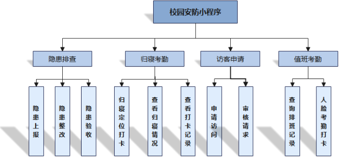
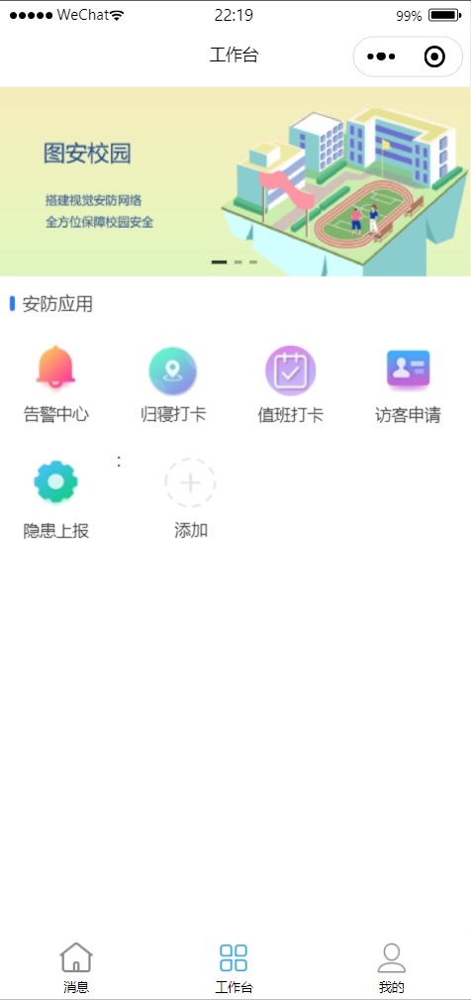
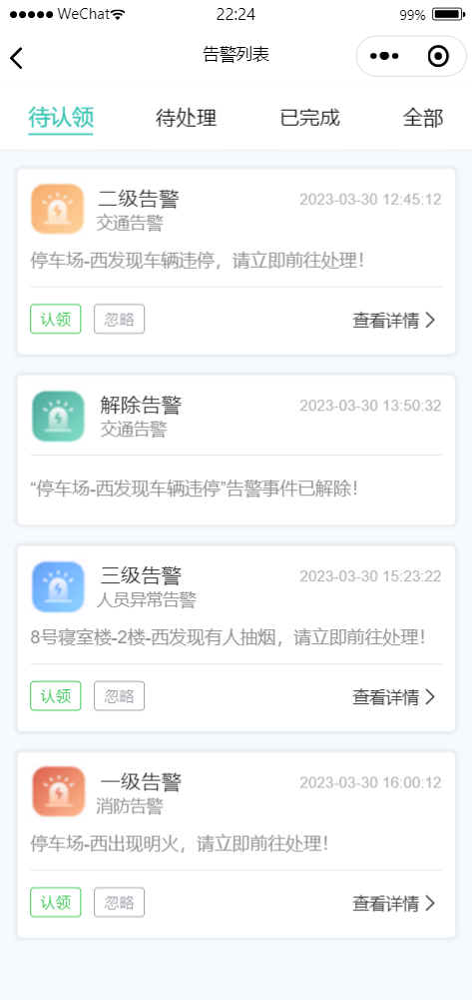
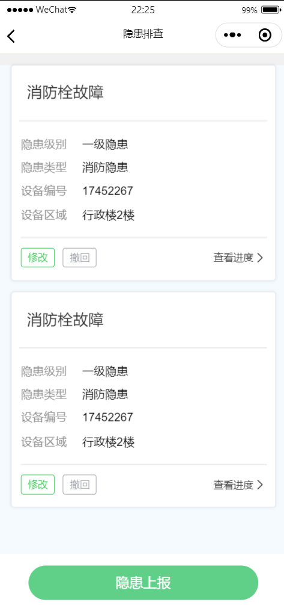
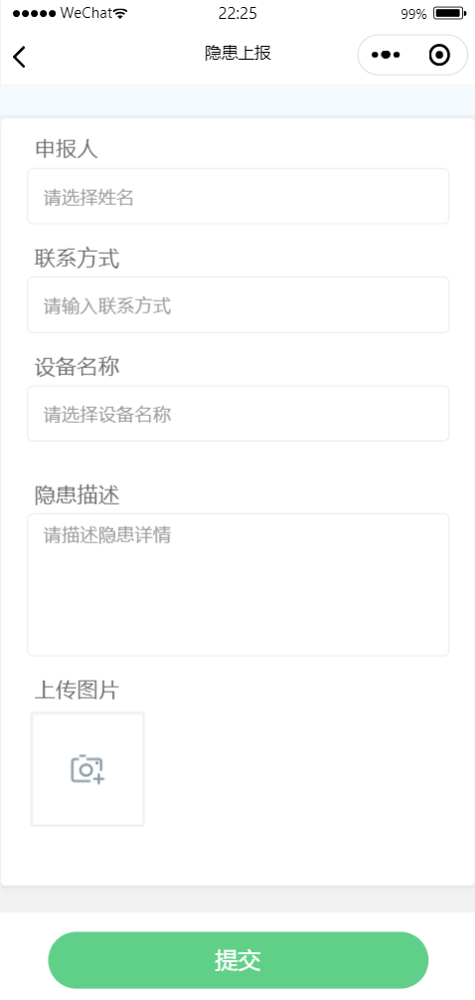
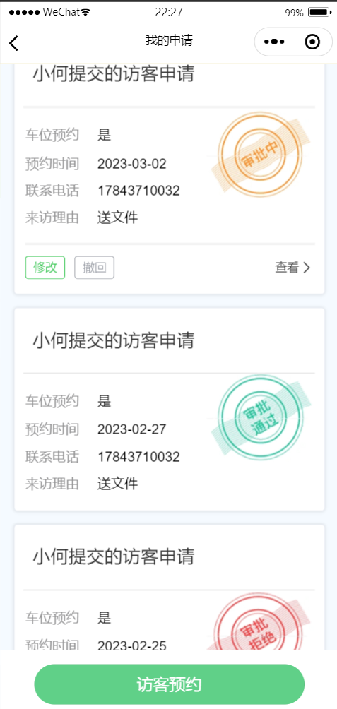
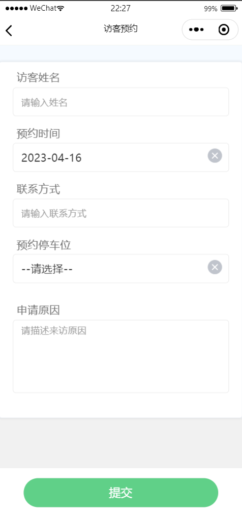
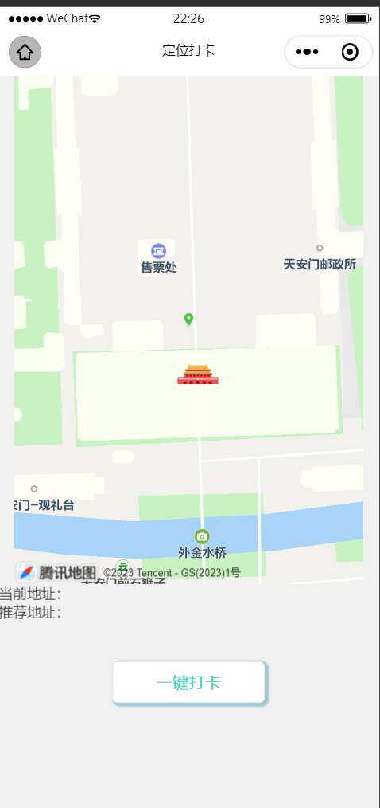
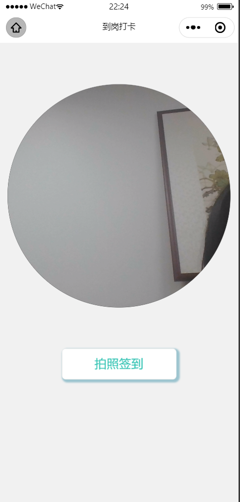
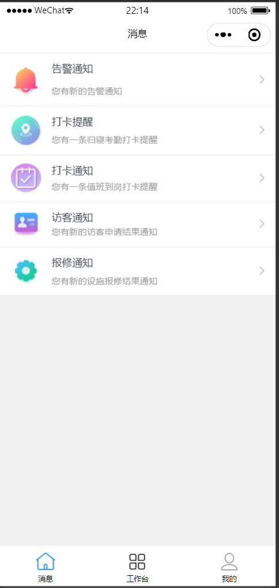

<h1 align="center" style="margin: 30px 0 30px; font-weight: bold;">图安校园安防微信小程序v1.0</h1>
<h4 align="center">基于UniApp开发的微信小程序</h4>

## 平台简介

图安校园安防微信小程序，采用uniapp框架，实现了与[tuan-admin-ui](https://github.com/QJC1123/tuan-admin-ui)对接的移动解决方案！目前已经实现登录、我的、工作台、告警通知、隐患上报、访客预约、定位打卡、人脸识别等功能。

图安校园安防微信小程序，属于“校园安防智能保障系统”的平台之一，“校园安防智能保障系统”项目获第十四届服务外包创新创业大赛**国家级二等奖**。

* 应用框架基于[uniapp](https://uniapp.dcloud.net.cn/)，支持小程序、H5、Android和IOS。
* 前端组件采用[uni-ui](https://github.com/dcloudio/uni-ui)，全端兼容的高性能UI框架。
* 实现定位打卡。利用[微信API](https://developers.weixin.qq.com/miniprogram/dev/framework/app-service/api.html)获取用户地理位置，使用[腾讯地图SDK](https://lbs.qq.com/mobile/androidMapSDK/developerGuide/androidSummary)获取地址信息，实现定位打卡。
* 实现人脸识别。利用camera组件和takePhoto方法获取照片，压缩为Base64格式，传递给后端，使用[百度人脸识别API](https://ai.baidu.com/ai-doc/FACE/Yk37c1opz)，进行人脸比对，实现人脸识别功能。
  

## 功能模块

1. 登录 
    用户登录。

2. 工作台 
    各个安防应用的入口，可以通过工作台快速访问告警处理、隐患上报、访客预约等功能。

3. 告警消息 
    收到实时的告警事件通知，安保人员可以迅速响应并认领处理各类安全问题。

4. 隐患排查 
    支持上报安全隐患、隐患整改、验收隐患整改情况。
    隐患上报界面，填写隐患上报表单，并上传相关图片，帮助快速发现并解决潜在的安全隐患。
    隐患消息界面，展示与隐患相关的处理信息，包括隐患发现、整改进度等。

5. 访客申请 
    填写访客预约申请表单，填写预约信息、来访时间等，并获得预约结果通知。
    预约人员查看他们的申请进度，包括访客预约成功通知、到访提醒。

6. 归寝考勤 
    学生可以进行归寝定位打卡。
    管理人员可以查看归寝情况以及打卡详情。家长可以查看学生打卡归寝记录以及学生安全状况。

7. 值班考勤 
    管理人员可以查询排班记录、进行人脸考勤打卡。

6. 消息列表 
    各项安防消息列表，包括告警消息、访客预约消息、隐患处理消息、打卡提醒消息等。

## 技术介绍

* #### 定位打卡 #### 

1. 微信用户授权获取定位。 
    引入微信地图组件，请求用户授权获取经纬度信息。
2. 地图SDK获取地理位置信息。 
    经纬度信息传递给腾讯地图 SDK，利用腾讯地图 SDK 的逆地址解析功能，获取对应的地理位置（地名）信息。
3. 后台设置打卡点 
    设置打卡点的地址经纬度，打卡范围参数，存储在数据库中，以便小程序访问。
4. 计算距离 
    Haversine 公式根据经纬度计算距离，判断用户是否可在该位置打卡。

* #### 人脸识别 #### 
1. 使用 camera 组件拍照 
    引入 camera 组件，点击按钮触发拍照操作。
    使用 takePhoto 方法获取用户拍摄的图片。
2. 将图片压缩为 base64 格式 
    压缩图片，转换为 base64 编码的字符串。
    将 base64 格式的图片数据传递给后端。
3. 调用百度人脸识别API 
    后端接收到前端传递的 base64 格式的图片数据，直接将 base64 编码的图片数据传递给百度人脸识别API进行人脸比对。
    百度人脸识别API返回识别结果，后端根据识别结果进行相应的处理和响应。

## 演示图

<table>
    <tr>
        <td>
            
            
&nbsp;&nbsp;&nbsp;&nbsp;&nbsp;&nbsp;&nbsp;&nbsp;&nbsp;&nbsp;&nbsp;&nbsp;&nbsp;&nbsp;&nbsp;&nbsp;&nbsp;&nbsp;入口界面

        </td>
        <td>
            
            
&nbsp;&nbsp;&nbsp;&nbsp;&nbsp;&nbsp;&nbsp;&nbsp;&nbsp;&nbsp;&nbsp;&nbsp;&nbsp;&nbsp;&nbsp;&nbsp;&nbsp;&nbsp;告警消息

        </td>
        <td>
            
            
&nbsp;&nbsp;&nbsp;&nbsp;&nbsp;&nbsp;&nbsp;&nbsp;&nbsp;&nbsp;&nbsp;&nbsp;&nbsp;&nbsp;&nbsp;&nbsp;&nbsp;&nbsp;隐患消息

        </td>
    </tr>
    <tr>
        <td>
            
            
&nbsp;&nbsp;&nbsp;&nbsp;&nbsp;&nbsp;&nbsp;&nbsp;&nbsp;&nbsp;&nbsp;&nbsp;&nbsp;&nbsp;&nbsp;&nbsp;&nbsp;&nbsp;隐患上报

        </td>
        <td>
            
            
&nbsp;&nbsp;&nbsp;&nbsp;&nbsp;&nbsp;&nbsp;&nbsp;&nbsp;&nbsp;&nbsp;&nbsp;&nbsp;&nbsp;&nbsp;&nbsp;&nbsp;&nbsp;访客消息

        </td>
        <td>
            
            
&nbsp;&nbsp;&nbsp;&nbsp;&nbsp;&nbsp;&nbsp;&nbsp;&nbsp;&nbsp;&nbsp;&nbsp;&nbsp;&nbsp;&nbsp;&nbsp;&nbsp;&nbsp;访客预约

        </td>
    </tr>
    <tr>
        <td>
            
            
&nbsp;&nbsp;&nbsp;&nbsp;&nbsp;&nbsp;&nbsp;&nbsp;&nbsp;&nbsp;&nbsp;&nbsp;&nbsp;&nbsp;&nbsp;&nbsp;&nbsp;&nbsp;定位打卡

        </td>
        <td>
            
            
&nbsp;&nbsp;&nbsp;&nbsp;&nbsp;&nbsp;&nbsp;&nbsp;&nbsp;&nbsp;&nbsp;&nbsp;&nbsp;&nbsp;&nbsp;&nbsp;&nbsp;&nbsp;人脸识别

        </td>
        <td>
            
            
&nbsp;&nbsp;&nbsp;&nbsp;&nbsp;&nbsp;&nbsp;&nbsp;&nbsp;&nbsp;&nbsp;&nbsp;&nbsp;&nbsp;&nbsp;&nbsp;&nbsp;&nbsp;消息列表

        </td>
    </tr>
</table>

## 开发
        # 克隆项目
        git clone https://github.com/QJC1123/tuan-wx-ui

        # 进入项目目录
        cd tuan-wx-ui

        # 安装依赖
        npm install

        # 启动服务
        npm run dev

